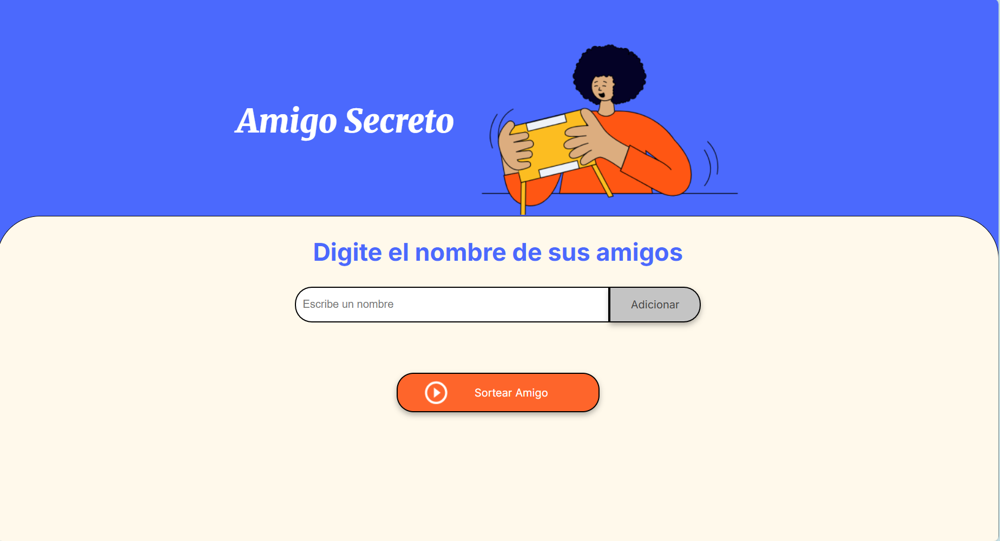
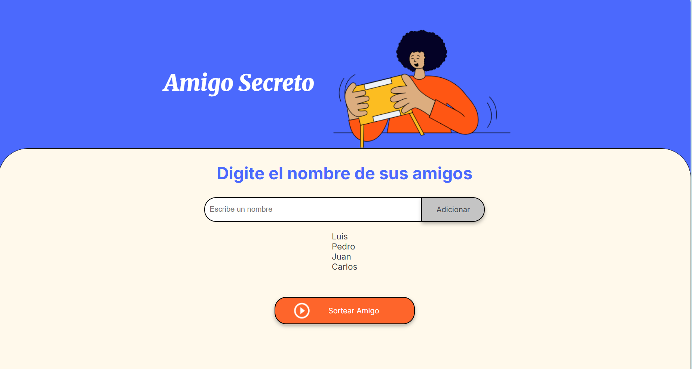

# Amigo Secreto

   

## Índice

* [Descripción del proyecto](#descripción-del-proyecto)
* [Estructura del proyecto](#estructura-del-proyecto)
* [Descripción de Archivos](#descripción-de-archivos) 
* [Funcionalidades](#funcionalidades)
* [Uso](#uso)
* [Tecnologías utilizadas](#tecnologías-utilizadas)
* [Capturas de Pantalla](#capturas-de-pantalla)
* [Autores](#autores)

## Descripción del Proyecto

Este proyecto es una aplicación web para sortear amigos secretos, en el se pone en practica la logica de Programación en JavaScript

## Estructura del Proyecto

El proyecto tiene la siguiente estructura de archivos:

## Descripción de Archivos

- `index.html`: Contiene la estructura HTML de la aplicación.
- `style.css`: Contiene los estilos CSS para la aplicación.
- `app.js`: Contiene la lógica de programación para agregar amigos y sortear el amigo secreto.
- `assets/`: Contiene las imágenes utilizadas en la aplicación.

## Funcionalidades

- **Agregar Amigos**: Permite agregar nombres de amigos a una lista.
- **Sortear Amigo Secreto**: Sortea un amigo secreto de la lista de amigos ingresados.

## Uso

1. Clona el repositorio en tu máquina local.
2. Abre el archivo `index.html` en tu navegador.
3. Ingresa los nombres de tus amigos en el campo de entrada y haz clic en "Adicionar". Para ingresar amigos con el mismo nombre agregae tambien el apellido Ejemplo: "Carlos Perez", "Carlos Ruiz"
4. Una vez que hayas ingresado al menos dos amigos, haz clic en "Sortear Amigo" para sortear el amigo secreto.

## Tecnologías Utilizadas

- HTML
- CSS
- JavaScript

## Capturas de Pantalla

## Autores

| [ Luis Pinto](https://github.com/luispp016) |
| :---: |
